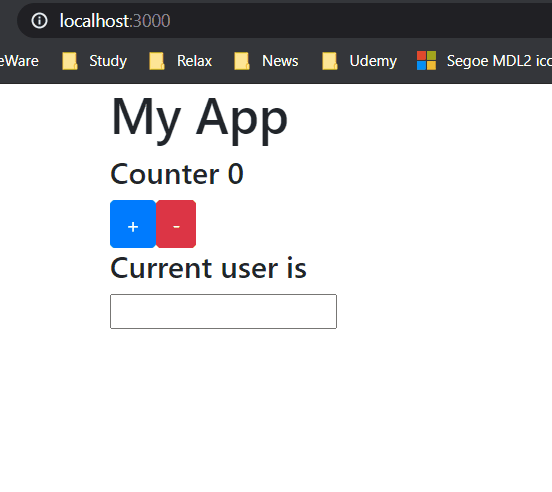

# Demo

# Simple React - Redux application
- Simple usage of the redux for data management

# Appp functionalities
## Counter to control 
- The increament value of the couter by 5
- The decrement value of the couter by 1
## Login - Logout
- Change the state of the user logged in by updating the button text and dispatch method
